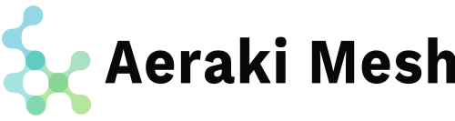
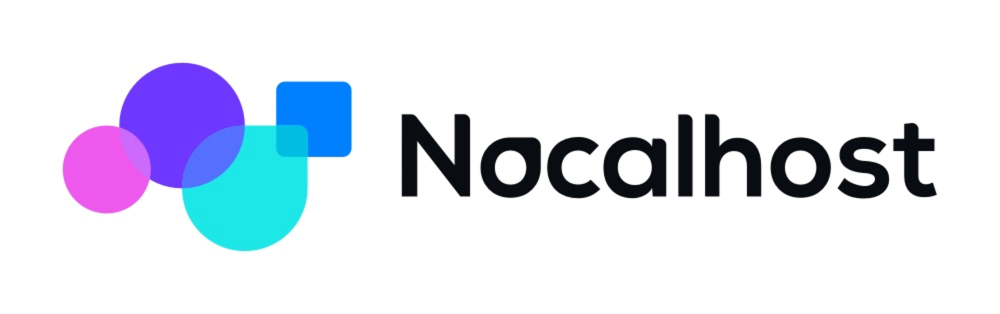
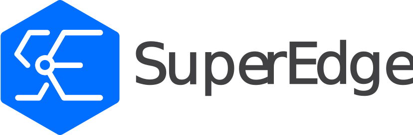
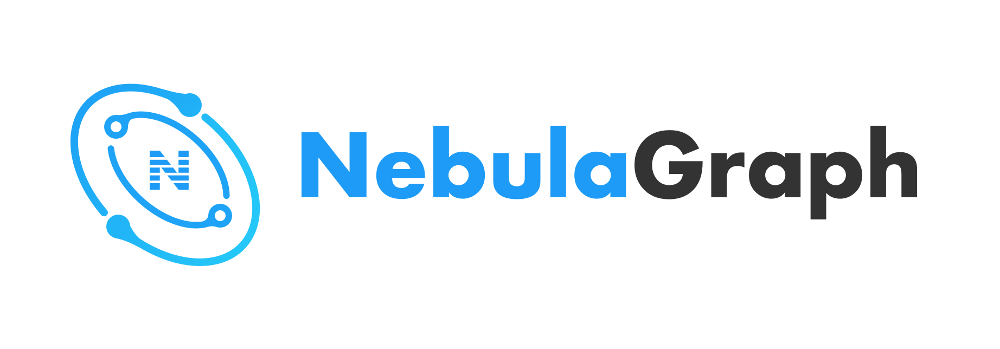
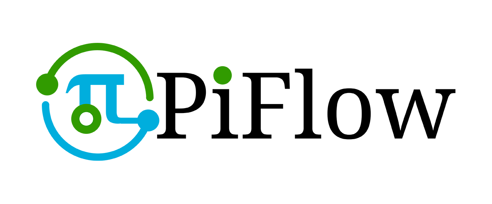
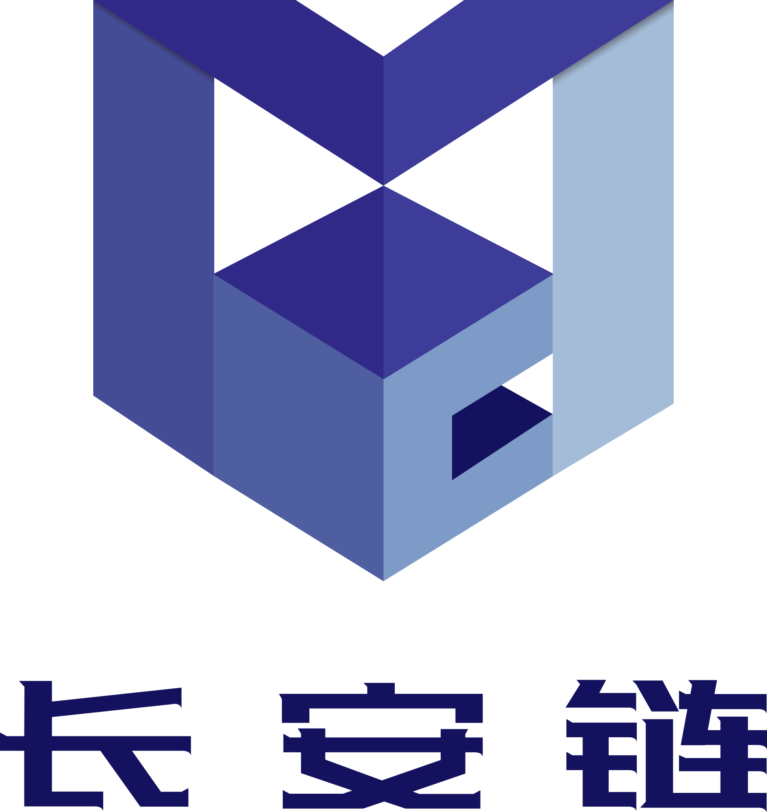
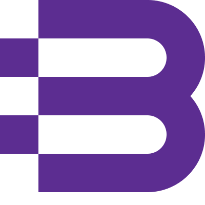
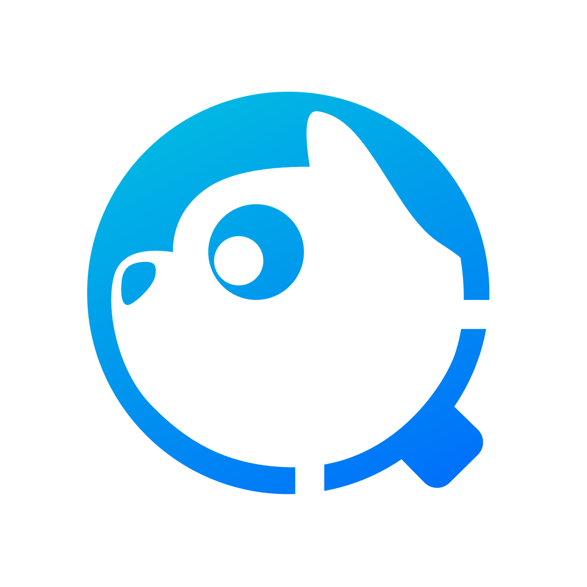

<h1 align="center">🌟WeOpen Star 支持项目列表🌟</h1>

🙋🏻‍♀️🙋🏻 立即参与开源贡献，你的每一个想法和意见都很珍贵 🙆🏻‍♀️🙆🏻

目录导航

- [云原生](#云原生-☁️)
- [大数据与数据库](#大数据与数据库-🖥)
- [操作系统](#操作系统-⚙️)
- [人工智能](#人工智能-🤖️)
- [网络&物联网](#网络物联网-🛸)
- [音视频](#音频视频-🎵)
- [区块链](#区块链-⛓️)
- [组件工具](#组件工具-🔧)
- [公益项目](#公益项目)

## 云原生 ☁️ 
| 项目名称 | 主要语言 | 项目简介 | 贡献指南 |
| :-: | :-: | - | - |
| <a href="https://github.com/apache/apisix"> <b>Apache apisix</b></a>  | Lua | APISIX 一个云原生、高性能、可扩展的微服务 API 网关，基于 OpenResty（Nginx+Lua）和 etcd 来实现。 |[立即参与](https://github.com/weopenprojects/WeOpen-Star/issues/22)|
|<a href="https://github.com/aeraki-mesh/aeraki"> <b>Aeraki Mesh</b></a> | Go |Aeraki 可以帮助你在服务网格中管理任何七层协议。目前 Aeraki 已经支持了 Dubbo、Thrit、Redis 等开源协议。你还可以使用 Aeraki 的 MetaProtocol 协议扩展框架来管理私有协议的七层流量。|[立即参与](https://github.com/weopenprojects/WeOpen-Star/issues/6)|
|<a href="https://github.com/apache/incubator-shenyu-dashboard"> <b>Apache shenyu</b></a> |JavaScript|Apache ShenYu(incubatng) 是一款高性能，多协议，易扩展，响应式的API网关，兼容各种主流框架体系，支持热插拔，用户可以定制化开发，满足用户各种场景的现状和未来需求，经历过大规模场景的锤炼|建设中|
|<a href="https://github.com/apache/skywalking"> <b>Apache SkyWalking</b></a> |Java|SkyWalking 是一款开源的应用性能监控系统，包括指标监控，分布式追踪，分布式系统性能诊断。|[立即参与](https://github.com/weopenprojects/WeOpen-Star/issues/33)|
|<a href="https://github.com/clickvisual/clickvisual"> <b>clickvisual</b></a> |Go|clickvisual 是一个轻量级的基于浏览器的日志分析和日志搜索平台，适用于某些数据源（ClickHouse 或 MySQL）。|[立即参与](https://github.com/weopenprojects/WeOpen-Star/issues/36)|
|<a href="https://github.com/clusternet/clusternet"> <b>Clusternet</b></a> |Go|Clusternet (Cluster Internet)是一个兼具多集群管理和跨集群应用编排的开源云原生管控平台，解决了跨云、跨地域、跨可用区的集群管理问题。 在项目规划阶段，就是面向未来混合云、分布式云和边缘计算等场景来设计的，支持海量集群的接入和管理、应用分发、流量治理（开发中）等。|建设中|
|<a href="https://github.com/gocrane/crane"> <b>Crane</b></a> |Go|基于云原生技术的成本优化开源项目Crane，致力于推荐资源和智能弹性配置，业务人员无需再为业务需要多少资源，自动扩缩容应该如何配置等问题而烦恼，Crane 会基于业务的时序变动数据给出最优解。|[立即参与](https://github.com/weopenprojects/WeOpen-Star/issues/13)|
|<a href="https://github.com/Tencent/DCache"><b>DCache</b></a> |C++|DCache是一个基于TARS框架开发的分布式NoSQL存储系统，数据采用内存存储，支持连接后端DB实现数据持久化。DCache采用集群模式，具有高扩展、高可用的特点。|建设中|
|<a href="https://github.com/apache/incubator-eventmesh"> <b>EventMesh</b></a> |Java|EventMesh是一个动态的云原生事件驱动架构基础设施，用于分离应用程序和后端中间件层，它支持广泛的用例，包括复杂的混合云、使用了不同技术栈的分布式架构。|[立即参与](https://github.com/weopenprojects/WeOpen-Star/issues/10)|
|<a href="https://github.com/polarismesh/femas"> <b>Femas</b></a> |JAVA、TypeScript|Femas 是腾讯云开源的云原生微服务一站式管理框架，聚焦微服务运行时，提供给多框架统一服务发现、南北及东西流量治理、服务可观测、配置管理等一站式微服务管控能力，解决企业微服务架构转型中异构框架复用难、 激增流量管控难、排障恢复耗时长等核心问题，帮助开发者将云原生中间件生态无缝集成到业务系统中，让企业能快速便捷的构建基于云原生的大规模分布式架构。|[立即参与](https://github.com/weopenprojects/WeOpen-Star/issues/18)|
|<a href="https://github.com/goharbor/harbor"> <b>Harbor</b></a> |Go、TypeScript|Harbor项目是帮助用户迅速搭建一个企业级的registry 服务。它以Docker公司开源的registry为基础，提供了管理UI, 基于角色的访问控制(Role Based Access Control)，镜像远程复制（同步），AD/LDAP集成、以及审计日志(Audit logging) 等企业用户需求的功能。|[立即参与](https://github.com/goharbor/harbor/blob/main/CONTRIBUTING.md)|
|<a href="https://github.com/kubesphere/kubekey"> <b>KubeKey</b></a> |Go|KubeKey 是一个开源的轻量级工具，用于部署、管理和交付 Kubernetes 集群，项目目标是致力于对 Kubernetes 集群的全生命周期管理。它提供了一种灵活、快速、方便的方式来支持在线和离线环境下安装 Kubernetes/K3s，KubeSphere，以及相关的云原生附加组件。|建设中|
|<a href="https://github.com/kaiyuanshe/osschat"> <b>OSS.Chat</b></a> |TypeScript|OSSChat 用于连接 IM 应用程序（例如，微信）和 Apache 社区工具（例如，邮件列表和 jira）。|建设中|
|<a href="https://github.com/linuxkerneltravel/lmp"> <b>LMP</b></a> |C|面向 eBPF 初学者和爱好者，提供 eBPF 学习资料、程序/项目案例，构建 eBPF 学习社区|建设中|
|<a href="https://github.com/nocalhost/nocalhost"> <b>Nocalhost</b></a> |Go|Nocalhost 一词源于 No Local，它是一款基于 IDE 的云原生开发工具，提供实时的云原生应用开发体验。使用 Nocalhost 开发云原生应用时，任何代码更改都可以立即在远程端生效，免去了提交、构建和推送镜像等步骤。能大幅提速编码自测的反馈过程，所以代码修改能实现秒级生效，提升研发效率。|建设中|
|<a href="https://github.com/PolarisMesh"> <b>PolarisMesh</b></a> |Go、Java|北极星是腾讯开源的服务发现和治理中心，致力于解决分布式或者微服务架构中的服务可见、故障容错、流量控制和安全问题。|[立即参与](https://github.com/weopenprojects/WeOpen-Star/issues/14)|
|<a href="https://github.com/Tencent/spring-cloud-tencent"> <b>Spring Cloud Tencent</b></a> |Java|Spring Cloud Tencent 是腾讯开发和维护的一站式微服务解决方案。 Spring Cloud Tencent 实现了Spring Cloud 标准微服务 SPI，开发者可以基于 Spring Cloud Tencent 快速开发 Spring Cloud 云原生分布式应用。|[立即参与](https://github.com/weopenprojects/WeOpen-Star/issues/17)|
|<a href="https://github.com/superedge/superedge"> <b>SuperEdge</b></a> |Go|SuperEdge是Kubernetes原生的边缘容器方案，它将Kubernetes强大的容器管理能力扩展到边缘计算场景中，针对边缘计算场景中常见的技术挑战提供了解决方案，如：单集群节点跨地域、云边网络不可靠、边缘节点位于NAT网络等。这些能力可以让应用很容易地部署到边缘计算节点上，并且可靠地运行。|[立即参与](https://github.com/superedge/superedge/blob/main/CONTRIBUTING.md)|
|<a href="https://github.com/TarsCloud/Tars"> <b>TARS</b></a> |C++|Tars这个名字取自于电影"星际穿越"中的机器人，它是基于名字服务使用Tars协议的高性能RPC开发框架，配套一体化的运营管理平台，并通过伸缩调度，实现运维半托管服务。Tars是腾讯从2008年到今天一直在使用的后台逻辑层的统一应用框架TAF（Total Application Framework），目前支持C++,Java,PHP,Nodejs,Go语言。该框架为用户提供了涉及到开发、运维、以及测试的一整套解决方案，帮助一个产品或者服务快速开发、部署、测试、上线。 |建设中|
|<a href="https://github.com/Tencent/Tendis"> <b>Tendis</b></a> |C++、Tcl|Tendis存储版是腾讯互娱CROS DBA团队 & 腾讯云数据库团队 自主设计和研发的开源分布式高性能KV存储。完全兼容redis协议，并使用rocksdb作为存储引擎。用户可以通过redis client访问Tendis存储版，几乎不用修改代码。同时，Tendis存储版支持远超内存的磁盘容量，可以大大降低用户的存储成本。|建设中|
|<a href="https://github.com/tkestack/tke"> <b>TKEStack</b></a> |Go、TypeScript|TKEStack 是一个开源项目，为在生产环境中部署容器的组织提供一个统一的容器管理平台。 TKEStack 可以简化部署和使用 Kubernetes，满足 IT 要求，并增强 DevOps 团队的能力。|建设中|
|<a href="https://github.com/WasmEdge/WasmEdge"> <b>WasmEdge</b></a> |C++|WasmEdge 是 CNCF 的沙箱项目，是一个轻量级、高性能和可扩展的 WebAssembly Runtime。WasmEdge 被应用在 Jamstack  应用、边缘云上的微服务、Serverless SaaS API、嵌入式函数、智能合约和智能设备上。目前有 3000+ stars，近一百个 commit 过代码的社区贡献者。|建设中|

## 大数据与数据库 🖥
| 项目名称 | 主要语言 | 项目简介 | 贡献指南 |
| :-: | :-: | - | - |
|<a href="https://github.com/apache/dolphinscheduler"> <b>Apache dolphinscheduler</b></a> |Java|一个分布式易扩展的可视化DAG工作流任务调度系统。致力于解决数据处理流程中错综复杂的依赖关系，使调度系统在数据处理流程中开箱即用。|[立即参与](https://github.com/weopenprojects/WeOpen-Star/issues/30)|
|<a href="https://github.com/apache/incubator-doris"> <b>Apache Doris</b></a> |C++、Java|Apache Doris是一款极速易用的开源MPP分析型数据库，仅需秒级甚至毫秒级响应时间即可返回海量数据下的查询结果，可有效支持实时数据分析、交互式数据分析等多种需求场景。Apache Doris以极简易用的特性被业内熟知，分布式架构非常简洁，易于运维，可以支持10PB以上的超大数据集|建设中|
|<a href="https://github.com/apache/incubator-inlong"> <b>Apache InLong</b></a> |Java|Apache InLong（应龙）是一个一站式海量数据集成框架，提供自动、安全、可靠和高性能的数据传输能力，同时支持批和流，方便业务构建基于流式的数据分析、建模和应用。|建设中|
|<a href="https://github.com/apache/kylin"> <b>Apache Kylin</b></a> |Java|Apache Kylin™是一个开源的、分布式的分析型数据仓库，提供Hadoop/Spark 之上的 SQL 查询接口及多维分析（OLAP）能力以支持超大规模数据，最初由 eBay 开发并贡献至开源社区。它能在亚秒内查询巨大的表。|建设中|
|<a href="https://github.com/apache/ozone"> <b>Apache Ozone</b></a> |Java|Ozone脱胎于Hadoop社区的HDFS项目，是新一代分布式对象存储开源项目，也是Apache最新的顶级项目之一。Ozone的目标是打造大数据场景下融合文件系统和对象存储的统一方案，生态上支持Hadoop FS，对象/S3，本地路径Mount和K8s CSI等多种访问方式，Ozone的设计主要是解决HDFS在大数据场景下的小文件和集群规模的限制。|建设中|
|<a href="https://github.com/apache/pulsar"> <b>Apache pulsar</b></a> |Java|Apache Pulsar 是下一代云原生分布式消息流平台，集消息、存储、轻量化函数式计算为一体，采用计算与存储分离架构设计，支持多租户、持久化存储、多机房跨区域数据复制，具有强一致性、高吞吐、低延时及高可扩展性等流数据存储特性。|建设中|
|<a href="https://github.com/apache/incubator-seatunnel"> <b>Apache Seatunnel</b></a> |Java、scala|SeaTunnel 是一个非常易用的支持海量数据实时同步的超高性能分布式数据集成平台，每天可以稳定高效同步数百亿数据，已在近百家公司生产上使用。|[立即参与](https://github.com/weopenprojects/WeOpen-Star/issues/29)|
|<a href="https://github.com/apache/shardingsphere"> <b>Apache ShardingSphere</b></a> |Java|Apache ShardingSphere 是一套开源的分布式数据库增强计算引擎，其通过可插拔架构构建基于数据库之上的生态系统，实现包括数据分片、弹性伸缩、加密脱敏等功能为代表的增强能力。|建设中|
|<a href="https://github.com/merico-dev/lake"> <b>DevLake</b></a> |Go、JavaScript|开源产品 DevLake 是一款开源的研发效能数据平台，提供自动化、一站式的数据集成、分析以及可视化能力，能够将散落在不同研发阶段和不同 DevOps 工具中的效能 数据汇集起来，转化为有效洞见，从而挖掘关键瓶颈与提效机会。|建设中|
|<a href="https://github.com/milvus-io/milvus"> <b>Milvus</b></a> |Go、Python|Milvus 是一款全球领先的开源向量数据库，赋能 AI 应用和向量相似度搜索，加速非结构化数据检索。用户在任何部署环境中均可获得始终如一的用户体验。Milvus 2.0 是一款云原生向量数据库，采用存储与计算分离的架构设计。该重构版本的所有组件均为无状态组件，极大地增强了系统弹性和灵活性。更多系统架构细节，参考 Milvus 系统架构。Milvus 基于 Apache 2.0 License 协议发布，于 2019 年 10 月正式开源，是 LF AI & Data 基金会 的毕业项目。|建设中|
|<a href="https://github.com/vesoft-inc/nebula"> <b>Nebula Graph</b></a> |C++、Gherkin|Nebula Graph是一个开源的图数据库，能够托管具有数十亿个顶点（节点）和数万亿条边的超大规模图，具有毫秒级的延迟。|建设中|
|<a href="https://github.com/cas-bigdatalab/piflow"> <b>PiFlow</b></a> |Scala、Java|PiFlow是一个基于分布式计算框架技术开发的大数据流水线处理与调度系统。该系统将大数据采集、清洗、存储与分析进行抽象和组件化开发，以所见即所得、拖拽配置的简洁方式实现大数据处理流程化配置、运行与智能监控。提供100+的数据处理组件，包括Hadoop 、Spark、MLlib、Hive、Solr、Redis、MemCache、ElasticSearch、JDBC、MongoDB、HTTP、FTP、XML、CSV、JSON等，更支持面向领域的二次组件开发。数据可溯源，性能优越。|建设中|
|<a href="https://github.com/Tencent/TBase"> <b>TDSQL PG（原名TBase）</b></a> |C|TDSQL PG（原名TBase）是腾讯自主研发的分布式数据库系统，具备高 SQL 兼容度、完整分布式事务、高安全、高扩展、多级容灾等能力，成功应用在金融、政府、电信等行业核心业务中。同时提供完善的容灾、备份、监控、审计等全套方案，适用于GB～PB级海量 HTAP 场景。|[立即参与](https://github.com/weopenprojects/WeOpen-Star/issues/11)|
|<a href="https://github.com/taosdata/TDengine"> <b>TDengine</b></a> |C、Java|TDengine 是一款高性能、分布式、支持 SQL 的时序数据库。而且除时序数据库功能外，它还提供缓存、数据订阅、流式计算等功能，最大程度减少研发和运维的复杂度，且核心代码，包括集群功能全部开源（开源协议，AGPL v3.0）。|建设中|

## 操作系统 ⚙️
| 项目名称 | 主要语言 | 项目简介 | 贡献指南 |
| :-: | :-: | - | - |
|<a href="https://github.com/linuxdeepin"> <b>深度开源社区中心（deepin）</b></a> |C++、Go|作为国产桌面操作系统的先行者，深度科技致力于推广开源文化，建设全球活跃的开源社区。仰望着理想的星空，深度科技也脚踏实地，持续为用户创造美观易用的产品，积极建设社区和应用生态，为开源建设默默贡献自己的力量。|建设中|
|<a href="https://github.com/OpenCloudOS"> <b>OpenCloudOS</b></a> |C|OpenCloudOS是由操作系统、云平台、软硬件厂商与个人共同倡议发起的操作系统社区项目。成立之初，即决定成为完全开放中立的开源社区，并已通过开放原子开源基金会的 TOC 评议，确认接受社区项目捐赠。社区将打造全面中立、开放、安全、稳定易用、高性能的Linux服务器操作系统为目标，与成员单位共同构建健康繁荣的国产操作系统生态。|建设中|
|<a href="https://github.com/RT-Thread/rt-thread"> <b>RT-Thread</b></a> |C|RT-Thread是一个来自中国的开源物联网操作系统，它提供了非常强的可伸缩能力：从一个可以运行在ARM Cortex-M0芯片上的极小内核，到中等的ARM Cortex-M3/4/7系统，甚至是多核，64位的ARM Cortex-A，MIPS32/64处理器的功能丰富系统|建设中|
|<a href="https://gitee.com/ukylin-os"> <b>优麒麟</b></a> |C|优麒麟是由麒麟软件有限公司主导开发的全球开源项目，专注于研发“友好易用，简单轻松”的桌面环境，致力为全球用户带来更智能的用户体验，成为Linux开源桌面操作系统新领航！UKUI 作为优麒麟默认搭载桌面环境，由优麒麟团队基于 QT 进行开发。同时支持 Ubuntu、Debian、Arch、openEuler 等主流 Linux 发行版。注重易用性和敏捷度，可以不依赖其它套件而独自运行，给用户带来亲切和高效的使用体验。自发布以来，便得到了 Linux 爱好者的广泛关注。|[立即参与](https://github.com/weopenprojects/WeOpen-Star/issues/25)|

## 人工智能 🤖️
| 项目名称 | 主要语言 | 项目简介 | 贡献指南 |
| :-: | :-: | - | - |
|<a href="https://github.com/Angel-ML/angel"> <b>Angel</b></a> |Java|Angel是一个基于参数服务器（Parameter Server）理念开发的高性能分布式机器学习和图计算平台，它基于腾讯内部的海量数据进行了反复的调优，并具有广泛的适用性和稳定性，模型维度越高，优势越明显。 Angel由腾讯和北京大学联合开发，兼顾了工业界的高可用性和学术界的创新性。Angel的核心设计理念围绕模型。它将高维度的大模型合理切分到多个参数服务器节点，并通过高效的模型更新接口和运算函数，以及灵活的同步协议，轻松实现各种高效的机器学习和图算法。|建设中|
|<a href="https://github.com/tencentmusic/cube-studio"> <b>cube-studio</b></a> |Python|Cube Studio是由TME研发的集成数据处理、分布式计算、机器学习模型训练、推理发布、超参搜索等多项功能的容器化算法平台, 帮助算法使用者提升算法迭代效率和共享度. Cube Studio包含多种组件, 支持TensorFlow、PyTorch等多种框架的分布式训练，自定义Pipeline构建等功能|[立即参与](https://github.com/weopenprojects/WeOpen-Star/issues/21)|
|<a href="https://github.com/FederatedAI/FATE"> <b>FATE</b></a>|Python|FATE（Federated AI Technology Enabler）是全球首个工业级联邦学习开源框架，使企业和机构能够在数据上进行协作，同时保护数据安全和隐私。它实现了基于同态加密和多方计算（MPC）的安全计算协议。支持各种联邦学习场景，FATE现在提供了一系列联邦学习算法，包括逻辑回归、基于树的算法、深度学习和迁移学习。|[立即参与](https://github.com/FederatedAI/FATE/blob/master/doc/develop/develop_guide.zh.md)|
|<a href="https://github.com/jina-ai"> <b>JinaAI</b></a>|Python|神经搜索是指用深度学习技术，对海量信息进行搜索，处理图像、视频、音频甚至 3D Mesh。多模态和跨模态搜索，是神经搜索的重要应用场景。 Jina AI 的神经搜索生态包括 DocArray, Jina, Hub, Finetuner, CLIP-as-service, Now, JCloud 等多个产品，全链路覆盖神经搜索解决方案的开发及搭建，降低了对工程化、AI 建模和以及 DevOps 等综合能力的要求，使得开发者可以更轻松地搭建神经搜索系统。|[立即参与](https://github.com/weopenprojects/WeOpen-Star/issues/20)|
|<a href="https://github.com/Tencent/ncnn"> <b>ncnn</b></a> |C++、C|ncnn 是一个为手机端极致优化的高性能神经网络前向计算框架。ncnn 从设计之初深刻考虑手机端的部署和使用。无第三方依赖，跨平台，手机端 cpu 的速度快于目前所有已知的开源框架。基于 ncnn，开发者能够将深度学习算法轻松移植到手机端高效执行，开发出人工智能 APP，将 AI 带到你的指尖。|[立即参与](https://github.com/weopenprojects/WeOpen-Star/issues/27)|
|<a href="https://github.com/4paradigm/OpenMLDB"> <b>OpenMLDB</b></a> |C++、Java|OpenMLDB 是一个开源机器学习数据库，提供生产级数据及特征开发全栈 FeatureOps 解决方案。|[立即参与](https://github.com/weopenprojects/WeOpen-Star/issues/31)|

## 网络&物联网 🛸
| 项目名称 | 主要语言 | 项目简介 | 贡献指南 |
| :-: | :-: | - | - |
|<a href="https://github.com/F-Stack/f-stack"> <b>F-Stack</b></a> |C|F-Stack是TencetCloud开源的全用户态高性能网络开发套件，基于DPDK、FreeBSD协议栈，并提供类POSIX接口方便应用接入。TencetCloud上已有COS/CDN/HttpDNS等使用F-Stack接入，极大提升了接入能力并降低了成本。|建设中|
|<a href="https://github.com/apache/iotdb"> <b>IoTDB</b></a> |Java|Apache IoTDB（物联网数据库）是一款高吞吐、高压缩、高可用、支持存储、管理与分析的物联网原生开源时序数据库系统软件。IoTDB 提出了轻量式端边云协同架构、独创物联网数据模型、自研时序存储文件格式，提供纳秒级采样数据写入、TB级数据毫秒级查询、数十倍数据无损压缩存储，支持丰富的时序数据查询操作，并与Apache Hadoop、Spark和Flink等进行了深度集成，以满足工业物联网领域的海量数据存储、高速数据读取和复杂数据分析需求。 Apache IoTDB项目源自清华大学，2020年成长为Apache基金会国际顶级项目，社区来自中、德、美、澳等全球代码贡献者近200人，社区企业用户规模数千人，目前已在国家电网、国家气象局、中航成飞、中核集团、长安汽车、金风科技等企业广泛应用。|建设中|

## 音频、视频 🎵
| 项目名称 | 主要语言 | 项目简介 | 贡献指南  |
| :-: | :-: | - | - |
|<a href="https://github.com/ossrs/srs"> <b>SRS</b></a> |C++|SRS是一个简单高效的实时视频服务器，支持RTMP/WebRTC/HLS/HTTP-FLV/SRT/GB28181|建设中|

## 区块链 ⛓️
| 项目名称 | 主要语言 | 项目简介 | 贡献指南  |
| :-: | :-: | - | - |
|<a href="https://git.chainmaker.org.cn/"> <b>ChainMaker</b></a> |Go|“长安链·ChainMaker”具备自主可控、灵活装配、软硬一体、开源开放的突出特点，由北京微芯研究院、清华大学、北京航空航天大学、腾讯、百度和京东等知名高校、企业共同研发。长安链作为区块链开源底层软件平台，包涵区块链核心框架、丰富的组件库和工具集，致力于为用户高效、精准地解决差异化区块链实现需求，构建高性能、高可信、高安全的新型数字基础设施，同时也是国内首个自主可控区块链软硬件技术体系。|建设中|

## 组件、工具 🔧
| 项目名称 | 主要语言 | 项目简介 | 贡献指南  |
| :-: | :-: | - | - |
|<a href="https://github.com/apache/incubator-linkis"> <b>Apache Linkis(Incubating)</b></a> |Java、Scala|Linkis 在上层应用程序和底层引擎之间构建了一层计算中间件。通过使用Linkis 提供的REST/WebSocket/JDBC 等标准接口，上层应用可以方便地连接访问MySQL/Spark/Hive/Presto/Flink 等底层引擎，同时实现变量、脚本、函数和资源文件等用户资源的跨上层应用互通。 作为计算中间件，Linkis 提供了强大的连通、复用、编排、扩展和治理管控能力。通过计算中间件将应用层和引擎层解耦，简化了复杂的网络调用关系，降低了整体复杂度，同时节约了整体开发和维护成本。 2021年8月2日，微众银行开源的计算中间件项目Linkis，全票通过了国际顶级开源组织Apache软件基金会的孵化器投票决议，成为了孵化项目Apache Linkis(Incubating)。|建设中|
|<a href="https://github.com/Tencent/APIJSON"> <b>APIJSON</b></a> |Java|APIJSON 是一种专为 API 而生的 JSON 网络传输协议 以及 基于这套协议实现的 ORM 库。为各种增删改查提供了完全自动化的万能 API，零代码实时满足千变万化的各种新增和变更需求。能大幅降低开发和沟通成本，简化开发流程，缩短开发周期。适合中小型前后端分离的项目，尤其是 初创项目、内部项目、低代码/零代码、小程序、BaaS、Serverless 等。|建设中|
|<a href="https://github.com/beego/beego"> <b>beego</b></a> |Go|beego 是用于 Go 编程语言的开源、高性能 Web 框架。。|[立即参与](https://github.com/Tencent/APIJSON/blob/master/CONTRIBUTING.md)|
|<a href="http://github.com/PGYER/codefever"> <b>CodeFever</b></a> |PHP、JavaScript|CodeFever 是一款完全免费开源的 Git 代码托管服务，由蒲公英团队开发。项目可以为使用 Git 的开发者团队提供安全、高效、可私有化部署的代码仓库托管服务，支持无限仓库、代码对比、分支管理、合并请求管理、分支保护、多人协作、Webhook 等特性，操作界面美观简洁，并为管理员提供了全局管理后台，并支持中英双语。|[立即参与](https://github.com/weopenprojects/WeOpen-Star/issues/32)|
|<a href="https://github.com/devstream-io/devstream"> <b>DevStream</b></a> |Go|开源产品 DevStream 是一款开源的 DevOps 工具链管理工具，将 DevOps 全生命周期各 个环节的主流开源工具管理起来，包括这些工具的快速安装部署、最佳实践配置、工具间的打通等，帮助研发团队高效、轻松地构建灵活 DevOps 工具链，提升研发效能。|建设中|
|<a href="https://github.com/gogf/gf"> <b>GoFrame</b></a> |Go|GoFrame是一款模块化、高性能、企业级的Go基础开发框架。GoFrame不是一款WEB/RPC框架，而是一款通用性的基础开发框架，是Golang标准库的一个增强扩展级，包含通用核心的基础开发组件，优点是实战化、模块化、文档全面、模块丰富、易用性高、通用性强、面向团队。如果您想使用Golang开发一个业务型项目，无论是小型还是中大型项目，GoFrame是您的不二之选。如果您想开发一个Golang组件库，GoFrame提供开箱即用、丰富强大的基础组件库也能助您的工作事半功倍。|[立即参与](https://github.com/weopenprojects/WeOpen-Star/issues/24)|建设中|
|<a href="https://github.com/snail007/goproxy"> <b>GoProxy</b></a> |Go|GoProxy是一款轻量级、功能强大、高性能的http代理、https代理、socks5代理、内网穿透代理服务器、ss代理、游戏盾、游戏代理，支持API代理认证。websocke代理、tcp代理、udp代理、socket代理、高防服务器。支持正向代理、反向代理、透明代理、TCP内网穿透、UDP内网穿透、HTTP内网穿透、HTTPS内网穿透、https代理负载均衡、http代理负载均衡、socks5代理负载均衡、socket代理负载均衡、ss代理负载均衡、TCP/UDP端口映射、SSH中转、TLS加密传输、协议转换、防污染DNS代理，限速，限连接数。|建设中|
|<a href="https://github.com/CloudWise-OpenSource/FlyFish"> <b>FlyFish</b></a> |JavaScript|飞鱼平台(FlyFish)是云智慧公司自主设计、研发的一款低门槛、高拓展性的低代码应用开发平台， 为数据可视化开发场景提供了高效的一站式解决方案。飞鱼提供丰富的组件和应用模板库， 可通过拖拉拽的形式完成数据可视化开发，零开发背景的用户也可完成数据可视化开发工作。 同时，飞鱼也提供了灵活的拓展能力，支持组件开发、自定义函数与全局事件等配置， 面向复杂需求场景能够保证高效开发与交付。|建设中|
|<a href=" https://github.com/cellbang/malagu"> <b>Malagu</b></a> |TypeScript|Malagu 是基于 TypeScript 的 Serverless First、组件化、平台无关的渐进式应用框架。|[立即参与](https://github.com/weopenprojects/WeOpen-Star/issues/23)|
|<a href="https://github.com/BlazorComponent/MASA.Blazor"> <b>Masa Blazor</b></a> |C#、HTML|基于Material设计规范和BlazorComponent的交互能力提供标准的基础组件库。提供如布局、弹框标准、Loading、全局异常处理等标准场景的预置组件。从更多实际场景出发，满足更多用户和场景的需求，最大的减少开发者的时间成本。缩短开发周期提高开发效率。并提供一套Web解决方案示例 - MASA Blazor Pro 有多种常见场景和预设布局等精彩内容。|[立即参与](https://github.com/weopenprojects/WeOpen-Star/issues/35)|
|<a href="https://gitee.com/openblock"> <b>OpenBlock</b></a> |JavaScript|OpenBlock是由开放原子开源基金会（OpenAtom Foundation）孵化及运营的开源项目。openblock是一门图形化编程语言，有自己的编译，链接，运行时。|建设中|
|<a href="https://github.com/kaiyuanshe/osschat"> <b>OSS.Chat</b></a> |TypeScript|OSSChat 用于连接 IM 应用程序（例如，微信）和 Apache 社区工具（例如，邮件列表和 jira）。|建设中|
|<a href="https://github.com/Tencent/CodeAnalysis"> <b>TCA</b></a> |Python、TypeScript|腾讯云代码分析（Tencent Cloud Code Analysis，简称TCA，内部曾用研发代号CodeDog）是集众多分析工具的云原生、分布式、高性能的代码综合分析跟踪平台，包含服务端、Web端和客户端三个组件，已集成一批自研工具，同时也支持动态集成业界各编程语言的分析工具。代码分析是通过词法分析、语法分析、控制流、数据流分析等技术对程序代码进行扫描，对代码进行综合分析，验证代码是否满足规范性、安全性、可靠性、可维护性等指标的一种代码分析技术。使用TCA可以帮助团队用代码分析技术查找代码中的规范性、结构性、安全漏洞等问题，持续监控项目代码质量并进行告警。同时TCA开放API，支持与上下游系统对接，从而集成代码分析能力，为代码质量提供保障，更有益于传承优良的团队代码文化。|[立即参与](https://github.com/weopenprojects/WeOpen-Star/issues/19)|

## 公益项目
| 项目名称 | 项目简介| 贡献指南 |
| :-: | - | - |
|[应急救援组件系统](https://github.com/wuhan2020)|对一线救援团队以及线上信息整理的志愿者，需要一系列能够保证其救援以及工作效率的工具，包括但不限于：爬虫，数据仓库，前端后端，地图绘制，数据分析等技术，这些技术并非要整合成为一个大的软件，而是要从实际的场景出发，组合成为一个开源的应用组件体系。在灾难救援场景下，可以快速应对不同的场景需求，迅速开发成多个小程序以及app的组件体系，灵活适用于一线救灾场景以及线上数据支持。现Wuan2020开源社区下共23个开源代码仓库，需要对代码进行完善。同时，需要进一步跟公益组织进行紧密合作，收集需求，进一步完善应急救援组件体系的需求。|建设中|
|[有益云开源社区](http://www.yyysoft.cn/)|有益云以微信小程序为核心应用平台，贯彻All In小程序理念，使用开放平台+开源框架技术服务中大型客户，SAAS平台服务小微客户，实现公益慈善行业客户和业务全覆盖，破除行业信息孤岛。 1、20+核心应用场景，200+功能，满足公益慈善行业90%以上业务需求； 2、成功案例经验流程固化成插件，公益慈善客户小程序可以一键安装，快速复制，便捷分享； 3、1000+行业专属API屏蔽复杂技术和逻辑，降低开发难度和成本，可以满足绝大部分业务场景定制开发需求； 4、20万行小程序源代码，公益慈善行业可以免费获得和使用，前端标准业务实现降低中大型客户个性化定制开发难度和成本； 5、技术、财务、法律、运营等行业支持机构提供全方位支持； 6、机构发布定制开发任务，社区极客可以提供专业开发服务；|建设中|
|乐龄申城·G生活|1、内容开源：（1）老年人学习智能设备的学习课程内容，包括办事、出行、消费、文娱、就医等系列教学视频、教学手册、教学方法等；（2）教学资源，包括上海地区社区教学场地及志愿者的共享 2、平台开放：（1）乐龄申城·G生活服务号；（2）乐龄申城·G生活IPTV频道；（3）乐龄申城·G生活智能服务热线 3、技术功能：（1）开放教学游戏接口，对接更多的教学内容；（2）开放一键助餐、一键查询等接口，赋能为老服务公益项目；（3）乐龄通，开放乐龄通的服务接口，对接更多的为老服务。|建设中|
|[公益表单管理系统](https://www.dome-gongyi.com/index.html)|自定义数据表单收集，发布，统计，分享|建设中|
|[云教室在线支教](http://www.tn1k.cn)|  1、应用技术：大数据、人工智能； 2、小学端：在系统中注册经审核通过后，需要对归属于小学的不同身份账号实现数据处理、互评等功能，小学管理员代表小学与社团或小队匹配对接，向对应的小队或社团提交授课需求； 3、志愿者端：在系统中注册，经审核通过后签订协议进入培训阶段，经过客观题答题、主观题讲稿提交、试讲三个环节，培训合格后可与小学需求对接，并由社团管理员或小队组长完成排课，正式进入授课环节，实现课程评价、期末互评、授课数据处理等功能； 4、志愿者管理员：社团管理员或小队管理员，对团队内志愿者实现管理功能，分配小学提交的需求匹配给合适的志愿者，并对完成匹配的志愿者进行排课，实现对团队内的数据处理、期末评价，实现对团队内志愿者借调、退出、审核等各项功能； 5、区域负责人：实现对区域内小队及志愿者的管理功能 6、机构管理员：实现后台对各角色、各环节、各数据的查看、操作功能|建设中|
|公益数字化（真爱梦想）|公益数字化项目的项目方案由多个成熟的产品作为组件及一些自研的组件组成。 权限控制器是构建在J2EE技术上的WEB项目，为整个公益数字化解决方案的权限控制组件。其通过CAS协议(中央认证服务)使得用户可以无缝登录项目中的其他产品，由后台管理以及前台的认证系统对用户进行权限的管理，并通过其API接口通知到其他系统。同由用户权限的不同，生成不同的导航界面，让用户可以方便快捷的访问到不同用户的组件。|建设中|
|“呼吸健康万人筛查”公益项目|呼吸健康万人筛查项目主要是向市民提供全免费的肺癌、慢阻肺及呼吸道过敏反应筛查公益服务，落实健康科普、社区宣传、公益筛查多项公益活动，以普及早筛、早诊、早治可以为患者极大减少身体痛苦和精神及经济负担，节省更多社会资源。 本系统按使用场景划分，可以分为基层场景（包括社区、社康、社工）以及体检中心场景，其中： 1）	基层场景，主要是提供一系列问卷初筛的解决方案，基层人员登陆自己的账号，创建患者档案，辅助受益人群答题，其中创建患者时，涉及的技术主要包括受益人群信息录入的OCR识别技术，受益人群知情同意书的电子签名技术等，问卷后背的逻辑计算技术等等； 2）	体检中心场景，在基层场景的基础上，需要建立科研级别数据库，存储包括LDCT的影像数据（Dicom文件）、肺功能测定数据、过敏原检测结果等一系列生物数据，涉及的技术主要是SQL数据库架构，人工智能自动识别检验报告等相关技术；|建设中|
