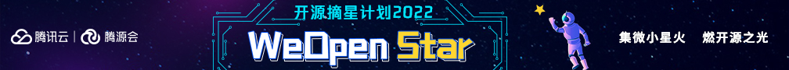

### 关于开源摘星计划✨

**开源摘星计划（WeOpen Star）** 是由腾源会 2022 年推出的全新项目，旨在为开源人提供成长激励，为开源项目提供成长支持，助力开发者更好地了解开源，更快地跨越鸿沟，参与到开源的具体贡献与实践中。    
  
不管你是开源萌新，还是希望更深度参与开源贡献的老兵，跟随“开源摘星计划”开启你的开源之旅，从一篇学习笔记、到一段代码的提交，不断挖掘自己的潜能，最终成长为开源社区的“闪亮之星”。    
  
我们将同你一起，探索更多的可能性！  

## 活动时间
**5月中旬-12月底**

|活动安排|活动时间|活动介绍|
|:-:|:-:|:-:|
|破冰仪式（直播）|5月16日|开源大牛分享，开源项目路演，贡献规则介绍|
|持续贡献|5月17日-11月|通过经验分享、初步贡献、深度贡献累积贡献积分
年终盛典|12月中下旬|开源摘星 100 人揭榜 腾讯总部参观交流及年终盛典

### 🏆 奖项与激励设置
#### 1. WeOpen Star 年度证书+礼包（100 名）
- 根据重点技术领域，按积分评选年度 100 名重要贡献的 **「开源之星」** ，颁发 **「开源摘星 100 人」** 荣誉证书及专属奖励。
- 年终颁奖：与开源项目创始人共同走访腾讯总部，并且参与 **「开源摘星 100 人」** 年终颁奖典礼。

#### 2. WeOpen Star 月度学习礼盒（10名/月）
- 每月评选「优秀贡献者」和「积极贡献者」，颁发摘星学习礼盒。

#### 3. 所有参与者都将获得「开源摘星者」纪念证书； 

### 如何参与？
参与本计划的开源项目与社区将于 5 月陆续公布其社区任务，所有参与者可在任务开放后，自由选择以 PR 或 Issue 提交的形式。[WeOpen Star 支持的项目](https://github.com/weopenprojects/WeOpen-Star/blob/main/Projects-list/README.md)
1. 填写报名表单（选择你意向贡献项目）；
1. 添加官方小助手微信（微信号：TCOS001）回复「摘星」，加入活动社群；
1. 自由选择你的贡献方向，累积你的贡献积分。

#### 👉方向一：
参与开源项目贡献不仅仅只是 `Coding`，也可以是从分享你的第一份学习笔记开始。

参与方式：

**Step 1** ：选择合适的主题，开始撰写、录制笔记/视频，并发布在任意博客/社区平台。

**Step 2** ：[自行更新个人积分](https://docs.qq.com/sheet/DSnRrR2dYZ1F6Qkh5)

注意：

- 学习笔记形式不限，文字/视频均可；
- 笔记需为原创文章/视频，且与主题相符，非灌水、广告；
- 笔记主题可以是包含开源项目学习、开源基础知识学习、开源工具使用方式等任何开源相关的主题；
-  每篇文章类笔记不少于 600 字，视频时长不少于 5分钟

__🎁 礼包 BUFF：__

每月将为本月优秀笔记作者颁发摘星者学习礼包，礼包奖品包括且不限于QQ公仔、QQ 音乐/腾讯视频会员年卡、腾源会T恤等。（奖品以当月发放为准）  
  

#### 👉方向二：
当你对项目有初步了解，可以开始完成一些简单的社区任务：

例如社区日常任务、good first issue（文档类）。任务完成后自行更新个人积分。[关于积分](/earn-points.md)  
  

#### 👉方向三：
在足够了解项目及贡献方式后， 可以开始尝试参与开源项目功能开发、 bug 修复（可组队解解决）。

参与方式：

**Step 1** ：在[WeOpen Star 支持项目列表](https://github.com/weopenprojects/WeOpen-Star/blob/main/Projects-list/README.md)中找到项目 issue 列表，进入其 issue 详情页，comment`[WeOpen Star]I would like to help`即代表认领任务成功 。

**step 2** ：基于 issue 进行开发，并且提交 PR。注意，在 PR 提交前，请将相关 issue 链接到你所提交的 PR 里;

**Step 3** ：PR提交后，项目 PMC 将进行 review， PR 被合并后即视为任务完成;

**Step 4** :  自行更新个人积分。[关于积分](/earn-points.md)

### 积分设置
|积分项|分值|
|:-:|:-:|
|提交符合规则的学习笔记（文章/视频形式皆可，可外部链接）|10分|
|参与项目例会、提交 Issue/Comment |1分|
|提交技术文档类（含翻译） Pull Request 且被合并|10分|
|提交项目功能/bug 修复类 Pull Request 且被合并|50分|
|特殊积分：由特殊贡献项设置的特别积分，由开源项目维护者为参与者申报|10-50分|

[积分规则详情](/earn-points.md)

#### 活动小贴士：
- 我们欢迎所有参与者，包含已有项目贡献经验的小伙伴参与项目贡献打卡；
- 高校&社区&项目合作：小助手微信（微信号：TCOS001），备注「摘星合作」
- 官方邮箱：[WeOpen@tencent.com](mailto:WeOpen@tencent.com)

### 「开源摘星计划（WeOpen Star）2022」诚挚感谢以下合作方：
**战略合作伙伴**：腾讯犀牛鸟、中国信息通信研究院 、上海开源信息技术协会、新商科教育教学开放创新联盟、湾区数字科技联盟、GoCN、开源社
**参与高校**：北京交通大学、复旦大学、华东理工大学、华东师范大学、清华大学、上海对外经贸大学、上海交通大学、西安邮电大学
**支持社区/媒体**：云加社区、腾讯TVP、开源中国、CSDN、InfoQ 、Segmentfault、掘金、51CTO、云原生时代、openTEKr、Gitee、开源基础软件社区
 
