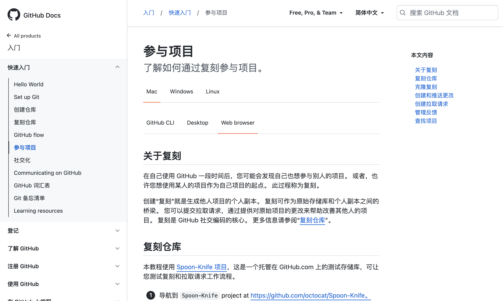
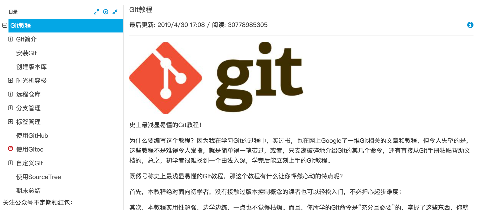
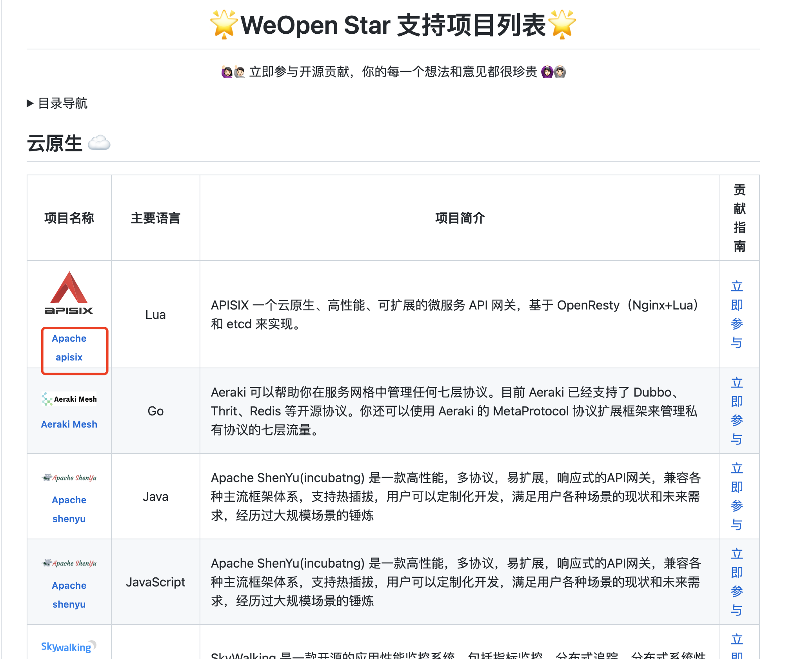
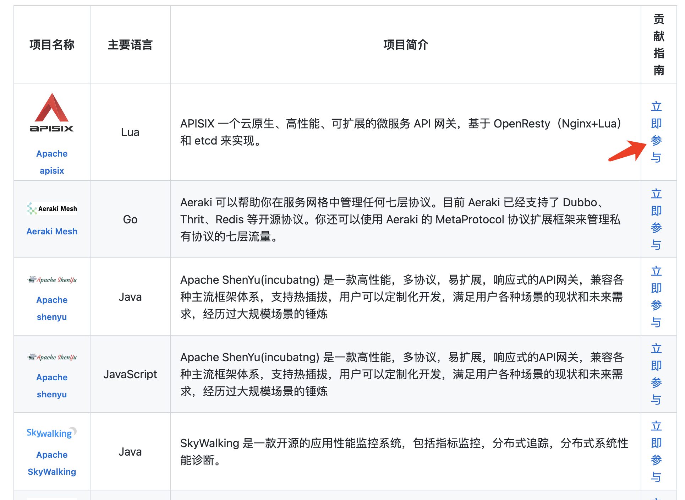
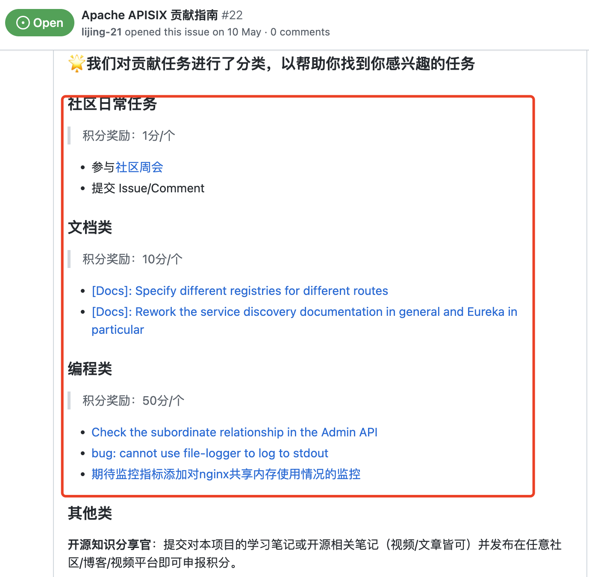
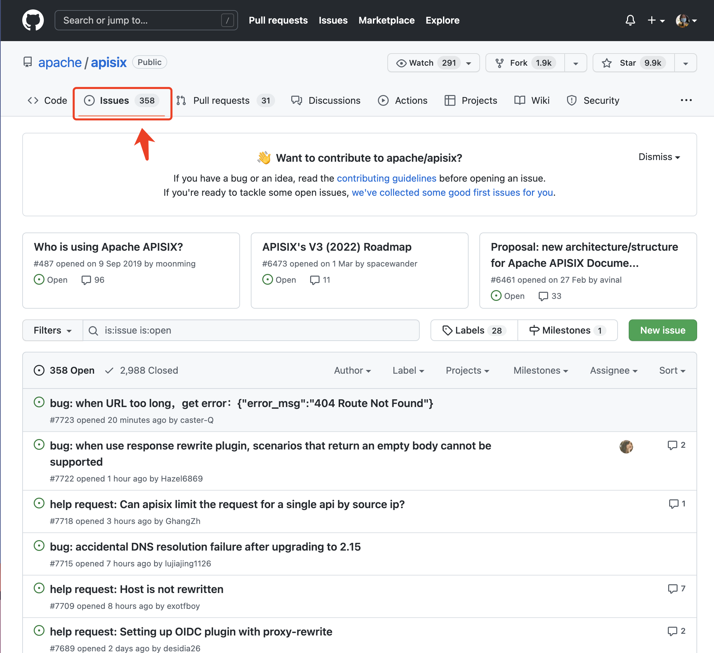
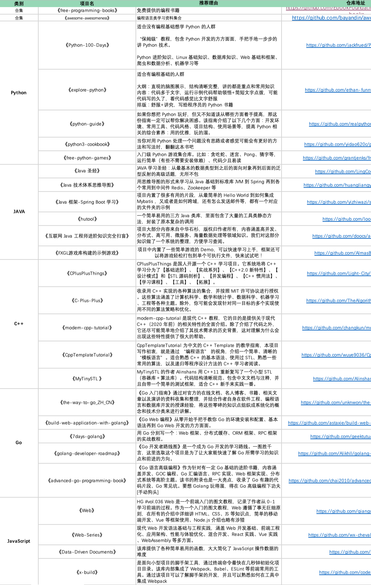
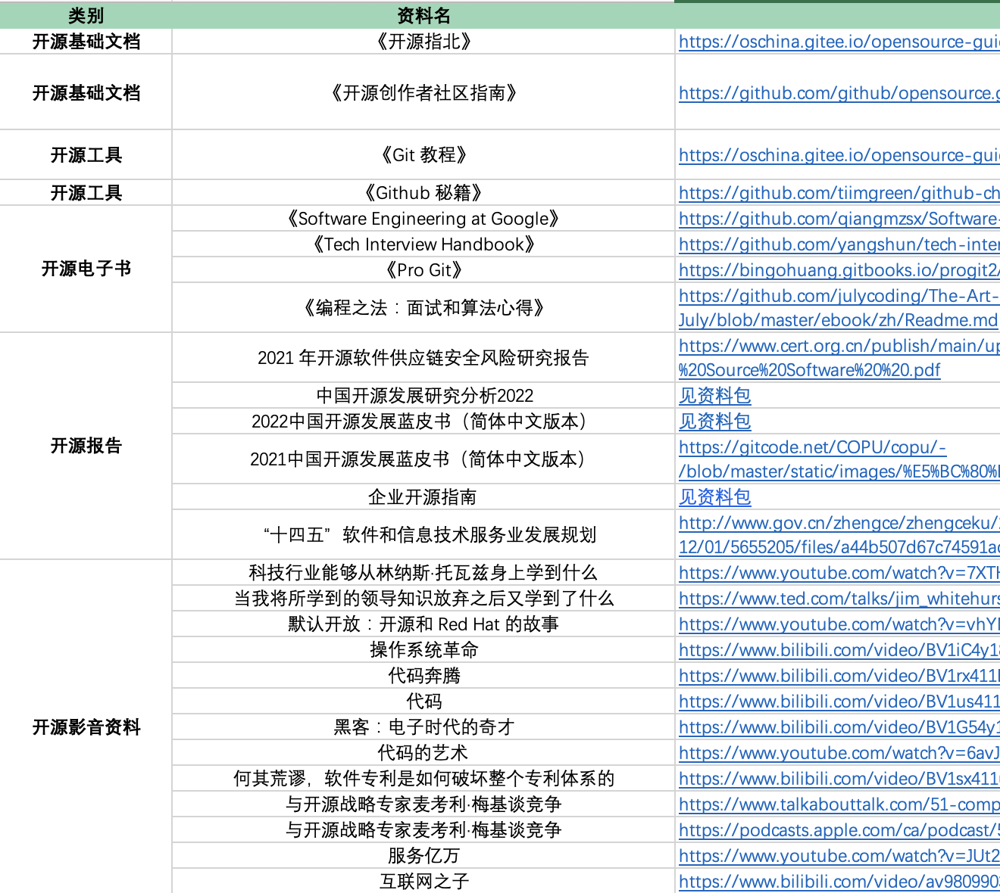
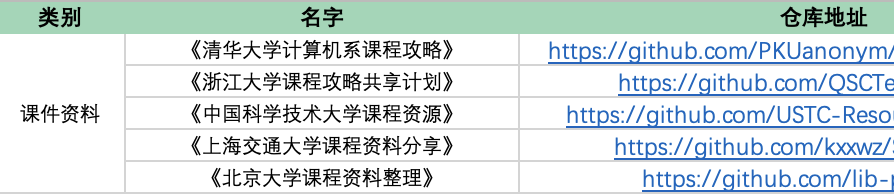

# 开源摘星计划学习成长资料&文档 📖

## 一、 了解开源是什么？
### 1、 开源基础学习文档
#### 1） 开源指北
《开源指北》从开源的基础概念、开源项目的学习使用以及如何参与开源项目等方方面面都进行了详细地介绍，是一本方便新手去了解「开源是什么」的最佳科普开源书籍之一。

[https://oschina.gitee.io/opensource-guide/guide/](https://oschina.gitee.io/opensource-guide/guide/)

#### 2） 开源创作者社区指南-如何为开源做贡献
开源指南为想要学习为开源项目做出贡献的个人提供的资源集合。多位优秀开源参与者一同讲述了「为什么要为开源做贡献」、「贡献意味着什么」、「如何提交贡献」等多个问题。

[https://opensource.guide/zh-hans/how-to-contribute/](https://opensource.guide/zh-hans/how-to-contribute/)

### 2、 学习使用开源基础工具
#### 1）了解 Github 平台
这里详细地介绍了 Github 平台的操作&使用，如何通过 Github 参与到项目中。

[https://docs.github.com/cn/get-started](https://docs.github.com/cn/get-started)

#### 2） 版本控制系统 Git 
Git 是一个免费开源分布式版本控制系统，主要用于代码版本管理。而 GitHub 是基于Git搭建的一个免费版本控制仓库（开源项目集中地），任何人都可以上传或下载平台上的开源项目。

简单来说，Git可以让你快速高效的对版本进行控制（修改）等功能。而 GitHub 正是使用了这个功能实现了更好的共同完成项目的功能。多了解一些关于 Git 的知识能帮助你更好的使用 GitHub。

[https://www.liaoxuefeng.com/wiki/896043488029600](https://www.liaoxuefeng.com/wiki/896043488029600)

## 二、 开源摘星计划成长攻略

### 常见Q&A
#### 1） 如何查找开源项目学习资料？
进入 [WeOpen Star 项目支持列表](https://github.com/weopenprojects/WeOpen-Star/blob/main/Projects-list/README.md)，点击任意项目名称即可进入官网，查看项目介绍信息。或上网查找项目相关学习资料。

#### 2） 如何寻找任务采集能量块？
a. 点击项目贡献指南查看、领取任务

b.进入项目仓库「issue」区查看、领取任务

## 三、 开源干货资料包
海量开源资源干货包整理：包含各类编程语言学习包、开源成长学习包、大学课程包以及开源报告类 PDF 资料。
添加小源好友（微信号：TCOSOO1）回复「摘星」，进入开源摘星计划群即可领取。

